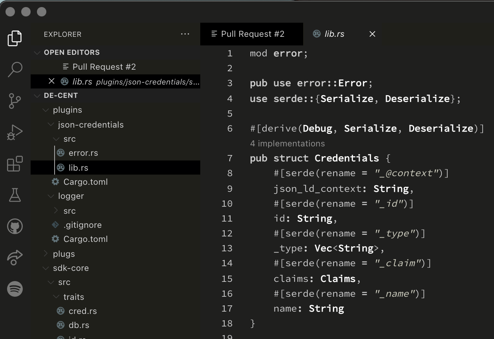

# VSCode Theme Boring Night

A dark theme with very few colors, on the border of boring.

## Languages supported

The following languages / filetypes are, somewhat, supported:

- Rust :)

If you've tested it with something else - please let me know.

## Issues & Pull Requests

Feel free to open an issue if you experience some strange behaviour.

If possible, include a screenshot and example code in your issue. If you
want to walk the extra mile - fire up the TextMate inspector
**Developer: Inspect TM Scopes** from the _Command Palette_ and
jot down the _"scope"_  in the GitHub issue as well.

If you want to add support for a new language, I will be happy to receive
Pull Requests - but please do not add any colors or make anything _italic_.

## Attribution

Theme is mostly cloned from [Boring](https://github.com/eliasson/vscode-theme-boring)
with attempt to revert colours for dark mode. (also released under MIT)

Some of the example files originates from @sdras VSCode theme
[Night Owl](https://github.com/sdras/night-owl-vscode-theme) (also released
under MIT)
